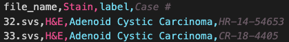

# Visual Dictinary Pipeline
The Visual Dictionary project leverages advanced Visual Transformer (ViT) models to process Whole Slide Images (WSIs), enabling effective categorization and analysis of these images.

## Requirements
- Python 3.x
- PyTorch
- NumPy
- torchvision
- PIL
- matplotlib
- timm (PyTorch Image Models)
- Additional dependencies as required by the scripts.
- Try utilizing the provided visual_dictionary_requirement.yml file for your conda environment.

## Installation
Download or clone this repository to your local machine. Ensure all required dependencies are installed.

## Steps for creating entire visual dictionary pipeline:
***Note: Always check the paths variables within files and change them as needed.***
### Step 1: Seperate the WSIs into and Train/Test set
- File: copy_slides.py
- We split the train/test sets based on the information inthe CSV file.
- Provide the path to the file containing your data information. It should include **"file_name"** and **"label"** columns:
    - 

### Step 2: Get train patches from the train dataset from the previous step
- File: quick_patching.py. 
- Provide the following arguments:
    - The number of words you require from the training set
    - The patch size
    - The destination for saving the output
The script iterates over each slide in the set, randomly selects the specified number of "visual words" and saves them as .png files in the designated directory. This functionality is particularly useful for training multiple different configurations in subsequent sessions.

Note that the number of words_per_slide **will be multiplied by 4**, as each patch is rotated 360 degrees. Ensure you do not generate an excessive number of patches unless desired. Based on experience, approximately 1 million patches works well for training. Consequently, the total number of words saved to your directory will be calculated as follows:

***number_of_WSIs_in_train_dir * words_per_slide * 4***

### Step 3: Train your model and save the path, experiment with layers/depth, etc....
- Files: 
    - model_vae_linear.py
    - conv_VAE.py
    - train_and_viz.ipynb. 
- You have the flexibility to modify anything within the two model files as needed. 
- Each file includes a test case at the bottom, allowing you to verify that your configuration works. These tests primarily ensure that the input and output shapes match and that the latent shapes are as desired. 
- One model uses a convolutional layer, while the other employs a linear layer. Feel free to experiment and make any necessary changes.
- After customizing or adding a model, you can run the train_and_viz.py script. This script loads all the training patches you created in the previous step. You can adjust the batch size and other parameters, though the current configuration is optimized for approximately 1 million training patches. 
- Training typically takes about an hour for 10 epochs.
- The script serves the purpose of saving a .png image of 5 input "visual words" and their corresponding model reconstructions after every 500 batches, allowing you to visualize the model's performance. Additionally, it prints a loss curve after each epoch using Mean Squared Error (MSE).

### Step 4: Run the entire visual dictionary pipeline
- File: entire_dictionary_pipeline.py 
- Ensure the number_words and all file paths are set correctly, and the script should run smoothly from test WSIs to Top1, Top3, and Top5 results. 

## Troubleshooting
For common issues, refer to the project's issue tracker or documentation.

## Contact
For any questions or issues
- tizhoosh.hamid@mayo.edu
- alabtah.ghazal@mayo.edu
- vaishkum101@gmail.com
- lukekottom@gmail.com 
